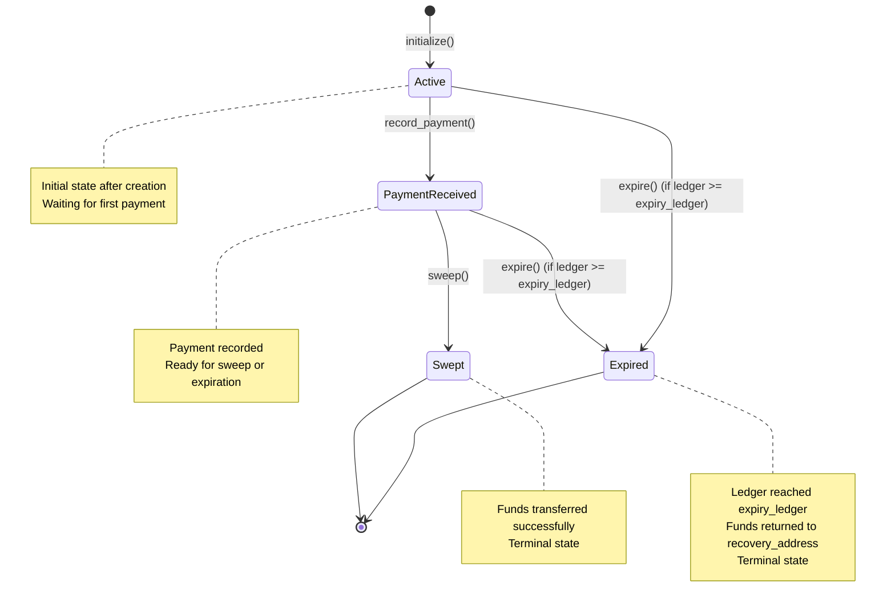
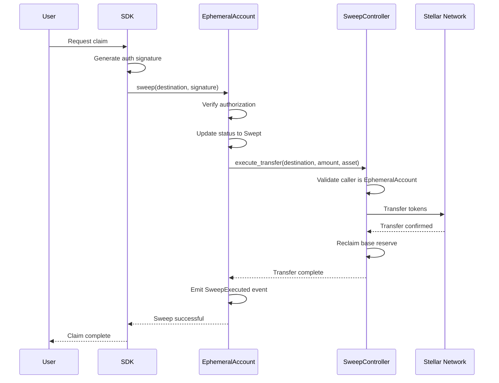
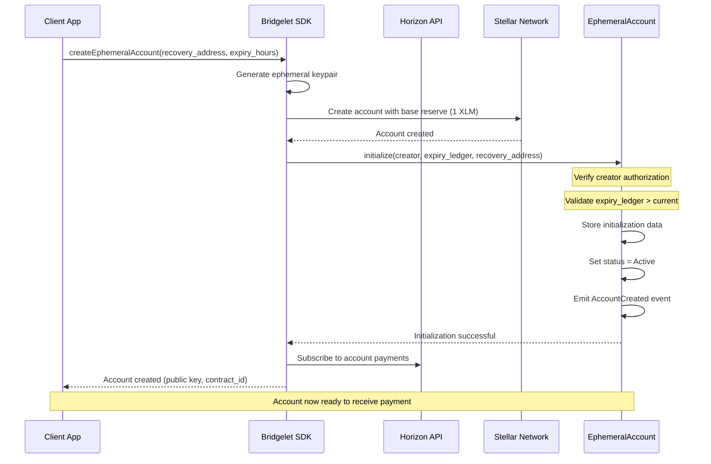
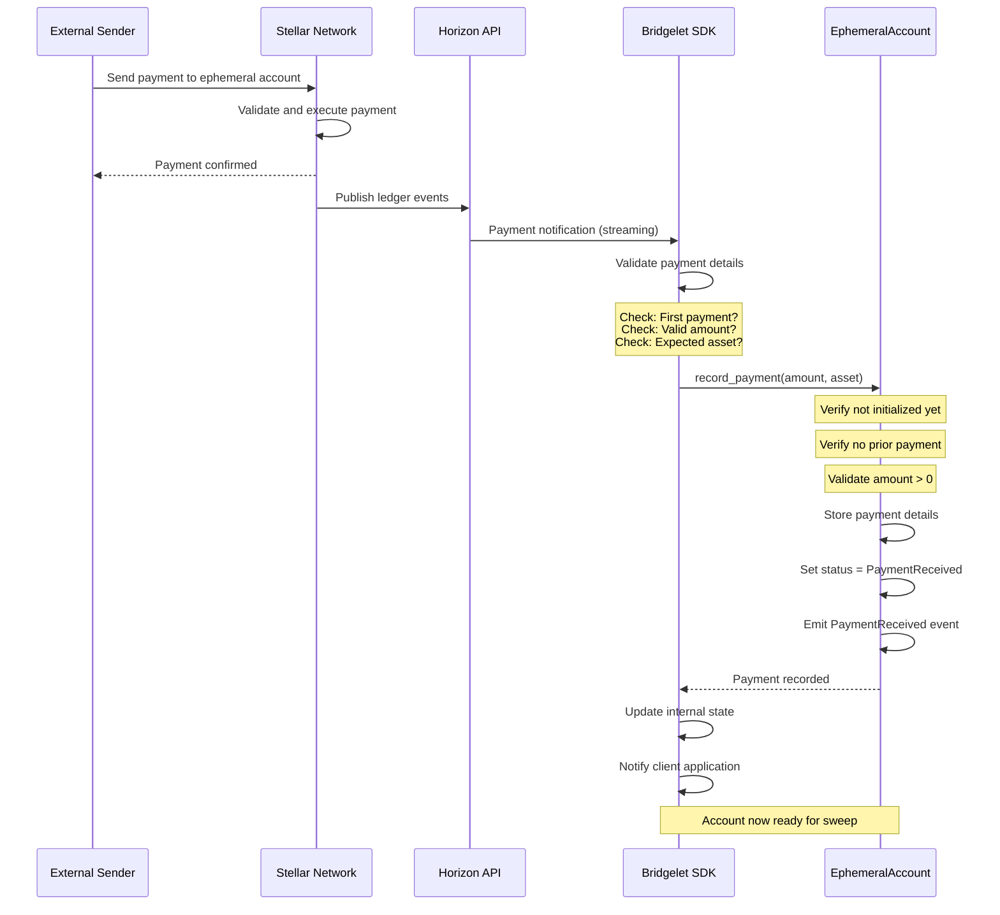
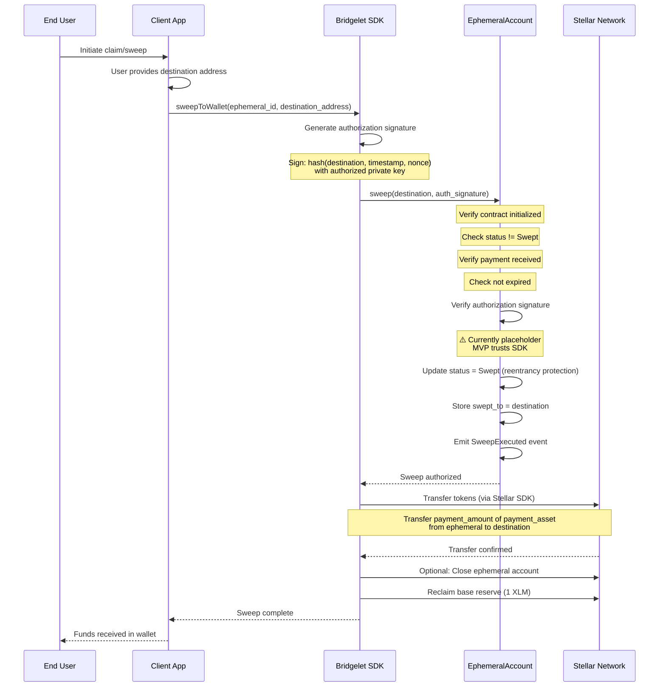
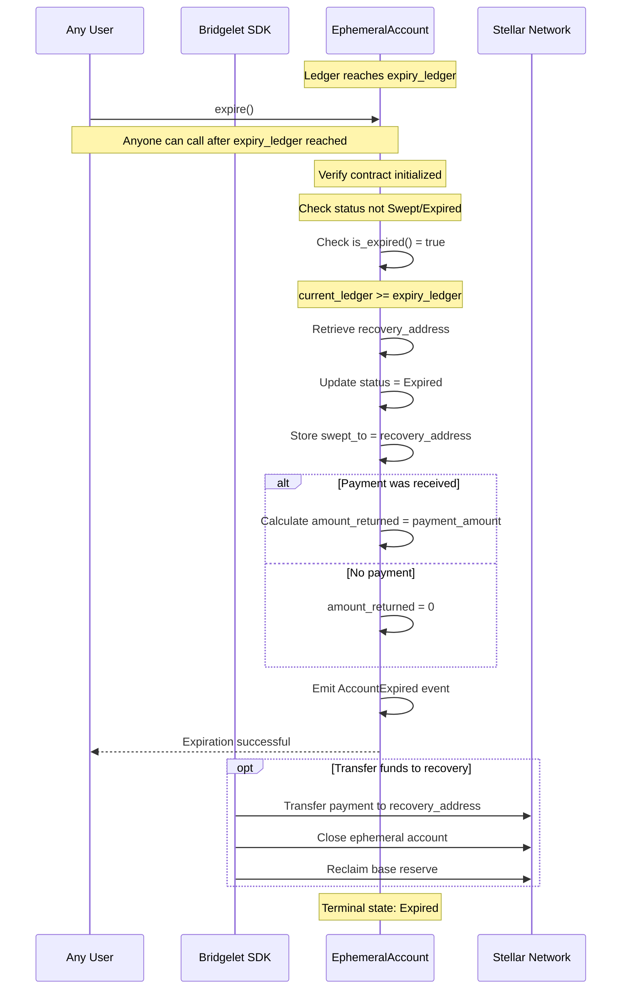

# Bridgelet Core Architecture

**Version:** 1.0  
**Last Updated:** January 21, 2026  
**Status:** MVP

> **Note**: This document describes the **intended API design** as specified in README.md (source of truth). The current MVP implementation may differ in some details. Where differences exist, they are noted with ⚠️ markers.

---

## Table of Contents

1. [Introduction](#introduction)
2. [System Architecture](#system-architecture)
3. [Contract Details](#contract-details)
   - [EphemeralAccount Contract](#ephemeralaccount-contract)
   - [SweepController Contract](#sweepcontroller-contract)
4. [Data Flow](#data-flow)
5. [Design Decisions](#design-decisions)
6. [Integration Points](#integration-points)
7. [Limitations](#limitations)
8. [Future Roadmap](#future-roadmap)

---

## Introduction

### Overview

Bridgelet Core is a suite of Soroban smart contracts that enable secure, single-use ephemeral accounts on the Stellar network. The system enforces business logic restrictions on temporary accounts, ensuring they can only receive one payment and be swept to a pre-authorized destination or expire after a defined period.

### Problem Statement

Traditional Stellar accounts are permanent and flexible by design. However, certain use cases require temporary accounts with strict restrictions:

- **One-time payment links** - Accounts that accept exactly one payment then become unusable
- **Claim-based transfers** - Funds that can only be moved to specific authorized destinations
- **Time-bounded accounts** - Accounts that automatically expire and return funds if unclaimed
- **Auditability** - Complete on-chain event trail for compliance and monitoring

Creating these restrictions purely at the application layer is insufficient—they must be enforced cryptographically at the protocol level.

### Solution Approach

Bridgelet Core uses smart contracts to enforce ephemeral account restrictions directly on-chain:

1. **Contract-enforced state machine** - Accounts transition through defined states (Active → PaymentReceived → Swept/Expired)
2. **Single payment validation** - Contract rejects multiple payments to the same account
3. **Authorization requirements** - Sweeps require cryptographic proof of authorization
4. **Time-based expiration** - Ledger-based expiry automatically returns funds to recovery address
5. **Event emission** - All state changes emit events for off-chain monitoring and indexing

### Target Audience

This document is intended for:

- **SDK Developers** - Building applications on top of Bridgelet Core
- **Security Auditors** - Reviewing contract security and design decisions
- **Integration Partners** - Connecting external systems to the Bridgelet ecosystem
- **Contract Maintainers** - Understanding the codebase for maintenance and upgrades

### Document Scope

This architecture document covers:

- High-level system design and component interactions
- Detailed contract specifications and interfaces
- Complete data flow for all operations
- Rationale for key design decisions
- Integration patterns and off-chain requirements
- Current limitations and future improvement plans

---

## System Architecture

### Component Overview

The Bridgelet Core system consists of three primary components:

```
┌─────────────────────────────────────────────────────────┐
│                    Bridgelet SDK (NestJS)               │
│                                                         │
│  ┌─────────────┐  ┌─────────────┐  ┌─────────────┐   │
│  │  Account    │  │   Claim     │  │  Lifecycle  │   │
│  │  Creation   │  │   Auth      │  │  Management │   │
│  └─────────────┘  └─────────────┘  └─────────────┘   │
│                                                         │
│  - Horizon API Integration                             │
│  - Signature Generation                                │
│  - Event Indexing                                      │
│  - Token Transfer Execution                            │
└────────────────────────┬────────────────────────────────┘
                         │ Soroban Contract Invocations
                         ▼
┌─────────────────────────────────────────────────────────┐
│              Stellar Network (Testnet/Mainnet)          │
│                                                         │
│  ┌───────────────────────────────────────────────────┐ │
│  │        EphemeralAccount Contract                  │ │
│  │                                                   │ │
│  │  • State Management (Active/Paid/Swept/Expired)  │ │
│  │  • Payment Recording & Validation                │ │
│  │  • Authorization Verification                    │ │
│  │  • Expiration Logic (Ledger-based)               │ │
│  │  • Event Emission (Auditability)                 │ │
│  │                                                   │ │
│  │  Storage: Instance Storage                       │ │
│  │  Events: AccountCreated, PaymentReceived,        │ │
│  │          SweepExecuted, AccountExpired           │ │
│  └───────────────────┬───────────────────────────────┘ │
│                      │                                  │
│                      │ Calls on sweep                   │
│                      ▼                                  │
│  ┌───────────────────────────────────────────────────┐ │
│  │        SweepController Contract (Planned)         │ │
│  │                                                   │ │
│  │  • Authorization Validation                       │ │
│  │  • Atomic Token Transfers                        │ │
│  │  • Multi-Asset Support                           │ │
│  │  • Base Reserve Reclamation                      │ │
│  │  • Batch Operations                              │ │
│  │                                                   │ │
│  │  Note: Currently in planning phase               │ │
│  └───────────────────────────────────────────────────┘ │
│                                                         │
└─────────────────────────────────────────────────────────┘
```

### Component Responsibilities

#### Bridgelet SDK (Off-Chain)

The SDK serves as the orchestration layer between client applications and smart contracts:

- **Account Creation**: Generates ephemeral accounts and calls `initialize()`
- **Payment Monitoring**: Watches Horizon API for incoming payments
- **Authorization**: Generates cryptographic signatures for sweep operations
- **Transfer Execution**: Executes actual token transfers via Stellar SDK
- **Event Indexing**: Subscribes to contract events for state tracking
- **Lifecycle Management**: Handles expiration and recovery scenarios

#### EphemeralAccount Contract (On-Chain)

The primary business logic contract that enforces restrictions:

- **State Enforcement**: Manages account lifecycle through state machine
- **Payment Validation**: Ensures only one payment is accepted
- **Authorization**: Verifies sweep authorization (signature validation)
- **Expiration**: Automatically handles time-based account expiry
- **Auditability**: Emits events for every state transition

**Current Status**: ✅ Fully Implemented

#### SweepController Contract (On-Chain - Planned)

Planned contract for secure fund transfer execution:

- **Transfer Logic**: Executes atomic token transfers from ephemeral to permanent wallets
- **Multi-Asset Support**: Handles transfers of multiple asset types
- **Reserve Management**: Reclaims base reserves after sweep
- **Batch Operations**: Potentially supports sweeping multiple accounts

**Current Status**: 📋 Planned (not yet implemented)

### Network Topology

**Current Deployment**: Stellar Testnet

The system is currently deployed on Stellar Testnet for development and testing. Production deployment will target Stellar Mainnet with the same contract architecture.

**Contract Addresses**:
- EphemeralAccount: `(deployed via soroban contract deploy)`
- SweepController: `(pending implementation)`

---

## Contract Details

### EphemeralAccount Contract

#### Purpose & Responsibilities

The EphemeralAccount contract is the core business logic layer that enforces single-use restrictions on temporary Stellar accounts. It acts as a state machine that validates and tracks the lifecycle of each ephemeral account from creation through either sweep or expiration.

**Key Responsibilities**:
1. Enforce single payment restriction
2. Validate sweep authorization
3. Handle time-based expiration
4. Emit events for auditability
5. Store account metadata and state

#### State Machine

The contract implements a strict state machine with four possible states:



**State Descriptions**:

- **Active** (0): Initial state after `initialize()`. Account is active and waiting for first payment.
- **PaymentReceived** (1): First payment has been recorded. Account is ready for sweep or may expire.
- **Swept** (2): Funds successfully swept to authorized destination. Terminal state.
- **Expired** (3): Account expired and funds returned to recovery address. Terminal state.

**State Transitions**:

| From | To | Trigger | Conditions |
|------|----|---------|-----------  |
| Active | PaymentReceived | `record_payment()` | Payment amount > 0, no prior payment |
| PaymentReceived | Swept | `sweep()` | Valid authorization, not expired |
| PaymentReceived | Expired | `expire()` | Current ledger >= expiry_ledger |
| Active | Expired | `expire()` | Current ledger >= expiry_ledger |

#### Storage Layout

The contract uses Soroban's **instance storage** exclusively, which persists state across invocations and is tied to the contract instance lifecycle.

**Storage Keys** (enum `DataKey`):

| Key | Type | Purpose | Set By | Read By |
|-----|------|---------|--------|---------|
| `Initialized` | `bool` | Tracks if contract initialized | `initialize()` | All functions |
| `Creator` | `Address` | Account creator address | `initialize()` | `get_info()` |
| `ExpiryTimestamp` | `u64` | Unix timestamp when account expires | `initialize()` | `is_expired()`, `expire()` |
| `SweepDestination` | `Option<Address>` | Optional destination for sweep | `initialize()` | `sweep()`, `expire()` |
| `PaymentReceived` | `bool` | Whether first payment recorded | `record_payment()` | `sweep()`, `record_payment()` |
| `PaymentAmount` | `i128` | Amount of recorded payment | `record_payment()` | `sweep()`, `get_info()` |
| `PaymentAsset` | `Address` | Asset address of payment | `record_payment()` | `sweep()`, `get_info()` |
| `Status` | `AccountStatus` | Current state (enum) | Multiple | `get_status()`, state checks |
| `SweptTo` | `Address` | Destination address after sweep/expiry | `sweep()`, `expire()` | `get_info()` |

**Storage Type Rationale**: Instance storage is used (vs. temporary storage) because account state must persist across multiple transactions throughout the account's lifecycle. The cost is justified by the requirement for durable state.

> **⚠️ Current MVP Implementation**: MVP uses `ExpiryLedger` (u32) and `RecoveryAddress` instead of `ExpiryTimestamp` and `SweepDestination`.

#### Function Reference

##### `initialize()`

**Purpose**: Initialize a new ephemeral account with restrictions.

**Signature**:
```rust
pub fn initialize(
    env: Env,
    creator: Address,
    sweep_destination: Option<Address>,
    expiry_timestamp: u64,
) -> Result<(), Error>
```

**Parameters**:
- `creator`: Address that creates this account (requires authorization)
- `sweep_destination`: Optional destination for sweep (can be set later if None)
- `expiry_timestamp`: Unix timestamp (seconds since epoch) when account expires

**Returns**: `Ok(())` on success, or error

**Errors**:
- `Error::AlreadyInitialized` - Contract already initialized (can only initialize once)
- `Error::InvalidExpiry` - `expiry_timestamp` <= current timestamp (must be in future)

**Behavior**:
1. Verifies contract not already initialized
2. Requires authorization from `creator`
3. Validates `expiry_timestamp` is in the future
4. Stores initialization data in instance storage
5. Stores optional `sweep_destination` (if provided)
6. Sets status to `Active`
7. Emits `AccountCreated` event

**Usage Example**:
```rust
// SDK calls initialize when creating ephemeral account
let creator = Address::from_str("GABC...");
let expiry = env.ledger().timestamp() + 86400; // 24 hours from now
let destination = Some(Address::from_str("GDEF...")); // Optional

contract.initialize(env, creator, destination, expiry)?;
```

> **⚠️ Current MVP Implementation**: The MVP uses `expiry_ledger: u32` and `recovery_address: Address` parameters instead of `sweep_destination` and `expiry_timestamp`. This will be migrated to the intended API in a future version.

---

##### `record_payment()`

**Purpose**: Record the first (and only) inbound payment to this account.

**Signature**:
```rust
pub fn record_payment(
    env: Env,
    amount: i128,
    asset: Address
) -> Result<(), Error>
```

**Parameters**:
- `amount`: Payment amount in asset units
- `asset`: Asset contract address (native = XLM address)

**Returns**: `Ok(())` on success, or error

**Errors**:
- `Error::NotInitialized` - Contract not initialized
- `Error::PaymentAlreadyReceived` - Payment already recorded (enforces single payment)
- `Error::InvalidAmount` - Amount <= 0

**Behavior**:
1. Verifies contract initialized
2. Checks no prior payment recorded (single payment enforcement)
3. Validates amount > 0
4. Stores payment details in instance storage
5. Updates status to `PaymentReceived`
6. Emits `PaymentReceived` event

**Usage Example**:
```rust
// SDK detects payment via Horizon, then records it
let amount = 1000000000i128; // 100 XLM (7 decimals)
let xlm_asset = Address::from_str("STELLAR_NATIVE...");

contract.record_payment(env, amount, xlm_asset)?;
```

**Important**: This function should be called by the SDK immediately after detecting a payment via Horizon monitoring. The SDK is responsible for payment detection; the contract only validates and records.

---

##### `sweep()`

**Purpose**: Transfer all funds to authorized destination wallet.

**Signature**:
```rust
pub fn sweep(
    env: Env,
    destination: Address
) -> Result<(), Error>
```

**Parameters**:
- `destination`: Recipient wallet address to receive funds

**Returns**: `Ok(())` on success, or error

**Errors**:
- `Error::NotInitialized` - Contract not initialized
- `Error::AlreadySwept` - Already swept (prevents double-sweep)
- `Error::NoPaymentReceived` - No payment to sweep
- `Error::AccountExpired` - Account has reached expiry timestamp
- `Error::Unauthorized` - Invalid authorization (via Soroban auth system)

**Behavior**:
1. Verifies contract initialized
2. Checks status not already `Swept`
3. Verifies payment has been received
4. Checks account not expired
5. Validates authorization via Soroban's built-in authorization system
6. Retrieves payment amount and asset
7. Updates status to `Swept` (prevents reentrancy)
8. Records `destination` in `SweptTo` storage
9. Emits `SweepExecuted` event

**Authorization Flow**:
```
User Request → SDK calls sweep() with proper auth context → 
Contract validates via Soroban auth → Approval given → 
SDK executes actual token transfer via Stellar SDK
```

**Important Notes**:
- Authorization is handled through Soroban's native authorization system
- The contract validates authorization but does NOT execute token transfer
- Actual transfer is performed by SDK via Stellar SDK after contract approval
- This separation ensures contract focuses on business logic, not token mechanics

**Usage Example**:
```rust
// SDK calls sweep with proper authorization context
let destination = Address::from_str("GXYZ..."); // User's permanent wallet

contract.sweep(env, destination)?;

// After contract approval, SDK executes actual transfer
```

> **⚠️ Current MVP Implementation**: The MVP includes an `auth_signature: BytesN<64>` parameter with placeholder verification. The intended design uses Soroban's native authorization system instead.

---

##### `is_expired()`

**Purpose**: Check if account has expired based on current timestamp.

**Signature**:
```rust
pub fn is_expired(env: Env) -> bool
```

**Returns**: `true` if current timestamp >= expiry_timestamp, `false` otherwise

**Behavior**:
1. Returns `false` if not initialized
2. Retrieves `expiry_timestamp` from storage
3. Compares against current ledger timestamp (ledger time)
4. Returns `true` if expired, `false` if still valid

**Usage Example**:
```rust
if contract.is_expired(env.clone()) {
    // Account expired, must call expire() to return funds
    contract.expire(env)?;
}
```

> **⚠️ Current MVP Implementation**: The MVP uses ledger sequence numbers (`expiry_ledger: u32`) instead of Unix timestamps.

---

##### `expire()`

**Purpose**: Handle account expiration and return funds to recovery address.

**Signature**:
```rust
pub fn expire(env: Env) -> Result<(), Error>
```

**Returns**: `Ok(())` on success, or error

**Errors**:
- `Error::NotInitialized` - Contract not initialized
- `Error::NotExpired` - Current timestamp < expiry_timestamp (too early)
- `Error::InvalidStatus` - Already swept or expired (terminal states)

**Behavior**:
1. Verifies contract initialized
2. Checks status is not already `Swept` or `Expired`
3. Verifies current timestamp >= expiry_timestamp
4. Retrieves sweep destination or default recovery address
5. Updates status to `Expired`
6. Records recovery address in `SweptTo`
7. Calculates amount to return (0 if no payment received)
8. Emits `AccountExpired` event

**Usage Example**:
```rust
// Anyone can call expire() after expiry_ledger reached
contract.expire(env)?;
// SDK then transfers any funds to recovery_address
```

**Important**: This function can be called by anyone once the expiry ledger is reached. The SDK is responsible for executing the actual token transfer to the recovery address after contract approval.

---

##### `get_status()`

**Purpose**: Retrieve current account status.

**Signature**:
```rust
pub fn get_status(env: Env) -> AccountStatus
```

**Returns**: Current `AccountStatus` enum value

**Behavior**:
- Returns `AccountStatus::Active` if not initialized
- Otherwise returns stored status from instance storage

**Usage Example**:
```rust
let status = contract.get_status(env);
match status {
    AccountStatus::Active => { /* waiting for payment */ },
    AccountStatus::PaymentReceived => { /* ready for sweep */ },
    AccountStatus::Swept => { /* completed */ },
    AccountStatus::Expired => { /* expired */ },
}
```

---

##### `get_info()`

**Purpose**: Retrieve complete account information.

**Signature**:
```rust
pub fn get_info(env: Env) -> Result<AccountInfo, Error>
```

**Returns**: `AccountInfo` struct with all account data, or error

**Errors**:
- `Error::NotInitialized` - Contract not initialized

**AccountInfo Structure**:
```rust
pub struct AccountInfo {
    pub creator: Address,
    pub status: AccountStatus,
    pub expiry_timestamp: u64,
    pub sweep_destination: Option<Address>,
    pub payment_received: bool,
    pub payment_amount: Option<i128>,
    pub swept_to: Option<Address>,
}
```

**Usage Example**:
```rust
let info = contract.get_info(env)?;
println!("Creator: {}", info.creator);
println!("Status: {:?}", info.status);
println!("Expires at: {}", info.expiry_timestamp); // Unix timestamp
if let Some(dest) = info.sweep_destination {
    println!("Sweep destination: {}", dest);
}
if let Some(amount) = info.payment_amount {
    println!("Payment amount: {}", amount);
}
```

> **⚠️ Current MVP Implementation**: MVP uses `expiry_ledger` and `recovery_address` instead.

#### Events

The contract emits events for all state changes to enable off-chain monitoring, indexing, and auditability.

**Event Design**: Events use `symbol_short!` macro which limits event names to 10 characters for efficiency.

##### `AccountCreated`

**Event Name**: `"created"`

**Payload**:
```rust
pub struct AccountCreated {
    pub account_id: Address,
    pub creator: Address,
    pub expiry: u64,
}
```

**Emitted By**: `initialize()`

**Purpose**: Signals that a new ephemeral account has been created.

**Usage**: Off-chain indexers can track account creation and monitor for expiration. The `account_id` enables efficient filtering by account.

> **⚠️ Current MVP Implementation**: MVP events use `expiry_ledger: u32` and don't include `account_id`.

---

##### `PaymentReceived`

**Event Name**: `"payment"`

**Payload**:
```rust
pub struct PaymentReceived {
    pub account_id: Address,
    pub amount: i128,
    pub asset: Address,
}
```

**Emitted By**: `record_payment()`

**Purpose**: Signals that the first (and only) payment has been recorded.

**Usage**: SDK can trigger sweep workflow after detecting this event. The `account_id` enables filtering events by specific account.

> **⚠️ Current MVP Implementation**: MVP events don't include `account_id` field.

---

##### `SweepExecuted`

**Event Name**: `"swept"`

**Payload**:
```rust
pub struct SweepExecuted {
    pub account_id: Address,
    pub destination: Address,
    pub amount: i128,
}
```

**Emitted By**: `sweep()`

**Purpose**: Signals that funds have been authorized for transfer to destination.

**Usage**: Off-chain systems can confirm successful sweep completion. The `account_id` enables filtering events by specific account.

> **⚠️ Current MVP Implementation**: MVP events include `asset` field and don't include `account_id`.

---

##### `AccountExpired`

**Event Name**: `"expired"`

**Payload**:
```rust
pub struct AccountExpired {
    pub account_id: Address,
}
```

**Emitted By**: `expire()`

**Purpose**: Signals that account expired and funds are being returned.

**Usage**: Off-chain systems can detect expiration and handle fund recovery. The `account_id` identifies which account expired.

> **⚠️ Current MVP Implementation**: MVP events include `recovery_address` and `amount_returned` fields instead of just `account_id`.

#### Error Types

The contract defines 12 distinct error codes:

| Error Code | Error Name | Meaning | Thrown By |
|------------|------------|---------|-----------|
| 1 | `AlreadyInitialized` | Contract already initialized | `initialize()` |
| 2 | `NotInitialized` | Contract not initialized | Most functions |
| 3 | `PaymentAlreadyReceived` | Payment already recorded | `record_payment()` |
| 4 | `Unauthorized` | Authorization validation failed | `sweep()` |
| 5 | `AlreadySwept` | Already swept, can't sweep again | `sweep()` |
| 6 | `NotExpired` | Tried to expire before expiry_ledger | `expire()` |
| 7 | `InvalidDestination` | Invalid destination address | (Reserved) |
| 8 | `InvalidAmount` | Amount <= 0 or invalid | `record_payment()` |
| 9 | `InvalidExpiry` | Expiry ledger in past | `initialize()` |
| 10 | `NoPaymentReceived` | No payment to sweep | `sweep()` |
| 11 | `AccountExpired` | Account expired, can't sweep | `sweep()` |
| 12 | `InvalidStatus` | Invalid status for operation | `expire()` |

---

### SweepController Contract

**Status**: 📋 Planned Feature (Not Yet Implemented)

#### Purpose & Responsibilities

The SweepController contract (when implemented) will handle the actual execution of fund transfers from ephemeral accounts to permanent wallets. It separates authorization logic (EphemeralAccount) from execution logic (SweepController).

**Planned Responsibilities**:
1. Execute atomic token transfers
2. Handle multiple asset types (XLM, USDC, custom tokens)
3. Reclaim base reserves after sweep
4. Support batch operations for efficiency
5. Provide reentrancy protection
6. Emit transfer confirmation events

#### Authorization Flow (Planned)



#### Transfer Mechanisms (Planned)

**Single Asset Transfer**:
- Transfer specified amount of single asset type
- Validate sufficient balance
- Execute atomic transfer via Stellar SAC (Smart Asset Contract)

**Multi-Asset Transfer** (Future):
- Iterate through all held assets
- Transfer each asset type
- All-or-nothing atomicity

**Reserve Reclamation**:
- After transfers complete, close ephemeral account
- Reclaim 1 XLM base reserve
- Transfer reserve to destination or recovery address

#### Error Handling (Planned)

Expected error scenarios:
- Insufficient balance for transfer
- Invalid asset contract address
- Transfer operation failed
- Unauthorized caller (not EphemeralAccount contract)
- Reentrancy attempt
- Reserve reclamation failed

#### Implementation Notes

**Why Not Implemented Yet?**

The MVP focuses on the authorization and state management layer (EphemeralAccount contract). The SDK currently handles actual token transfers via the Stellar SDK, which is sufficient for initial testing and validation.

**Future Implementation**:

When implemented, SweepController will:
1. Provide on-chain transfer execution guarantees
2. Enable atomic multi-asset transfers
3. Simplify SDK implementation
4. Improve security through contract-enforced transfers

**API Preview** (Tentative):
```rust
pub trait SweepControllerInterface {
    /// Execute sweep transfer
    fn execute_transfer(
        env: Env,
        caller: Address,  // Must be EphemeralAccount contract
        destination: Address,
        amount: i128,
        asset: Address,
    ) -> Result<(), Error>;
    
    /// Reclaim base reserve
    fn reclaim_reserve(
        env: Env,
        ephemeral_account: Address,
        destination: Address,
    ) -> Result<(), Error>;
}
```

---

## Data Flow

This section documents the complete data flow for all major operations in the Bridgelet Core system.

### Account Creation Flow



**Step-by-Step Explanation**:

1. **Client Request**: User/application requests creation of ephemeral account
2. **Keypair Generation**: SDK generates a new Stellar keypair for the ephemeral account
3. **Account Creation**: SDK creates Stellar account with 1 XLM base reserve
4. **Contract Initialization**: 
   - SDK calls `initialize()` on EphemeralAccount contract
   - Passes creator address, expiry ledger, and recovery address
   - Contract verifies creator authorization (requires signature)
   - Contract validates expiry is in future
   - Contract stores initialization data in instance storage
   - Contract sets status to `Active`
   - Contract emits `AccountCreated` event
5. **Payment Monitoring**: SDK subscribes to Horizon for payment notifications
6. **Return to Client**: SDK returns public key and contract ID

**Error Scenarios**:
- Account creation fails → SDK returns error, no contract call
- `AlreadyInitialized` → Contract already initialized (prevents re-initialization)
- `InvalidExpiry` → Expiry ledger in past (validation error)

**Time Estimates**:
- Account creation: ~5 seconds (1 ledger)
- Contract initialization: ~5 seconds (1 ledger)
- Total: ~10 seconds

---

### Payment Flow



**Step-by-Step Explanation**:

1. **External Payment**: Someone sends payment (XLM, USDC, etc.) to ephemeral account
2. **Stellar Execution**: Stellar network validates and executes payment
3. **Event Publishing**: Payment appears in ledger, Horizon API publishes event
4. **SDK Detection**: SDK's Horizon subscription receives payment notification
5. **Validation**: SDK validates payment details:
   - Confirms this is the first payment
   - Validates amount is positive
   - Checks asset type matches expected
6. **Recording**: SDK calls `record_payment()` on contract
7. **Contract Validation**:
   - Verifies contract is initialized
   - Checks no prior payment recorded (enforces single payment)
   - Validates amount > 0
8. **State Update**:
   - Contract stores payment amount and asset
   - Contract updates status to `PaymentReceived`
   - Contract emits `PaymentReceived` event
9. **Notification**: SDK updates internal state and notifies client

**Error Scenarios**:
- `PaymentAlreadyReceived` → Second payment attempted (rejected)
- `InvalidAmount` → Amount <= 0 (validation error)
- `NotInitialized` → Contract not initialized (setup error)

**Single Payment Enforcement**:

The contract enforces that only ONE payment can be recorded. If a second payment is sent to the Stellar account, the SDK will detect it but the contract will reject the `record_payment()` call with `PaymentAlreadyReceived` error.

**Important**: The sender's funds are NOT automatically returned if a second payment is sent. The Stellar account receives the payment, but the contract does not track it. This is a known limitation of the single-payment design.

---

### Sweep Flow



**Step-by-Step Explanation**:

1. **User Initiates**: User clicks "Claim" or "Sweep to Wallet" in client application
2. **Destination Provided**: User provides or confirms destination wallet address
3. **SDK Call**: Client calls SDK's `sweepToWallet()` function
4. **Signature Generation**: 
   - SDK generates authorization signature
   - Signs hash of (destination, timestamp, nonce) with authorized key
   - ⚠️ Current MVP: signature verification is placeholder
5. **Contract Authorization**:
   - SDK calls `sweep(destination, auth_signature)` on contract
   - Contract performs validation checks:
     - Initialized? ✓
     - Status not already Swept? ✓
     - Payment received? ✓
     - Not expired? ✓
   - Contract verifies authorization signature (⚠️ currently placeholder)
6. **State Update** (Reentrancy Protection):
   - Contract updates status to `Swept` BEFORE external calls
   - This prevents reentrancy attacks
   - Contract stores destination in `swept_to` field
   - Contract emits `SweepExecuted` event
7. **Transfer Execution**:
   - SDK receives contract approval
   - SDK executes actual token transfer via Stellar SDK
   - Transfers `payment_amount` of `payment_asset` from ephemeral to destination
8. **Reserve Reclamation** (Optional):
   - SDK closes ephemeral account
   - 1 XLM base reserve returned to destination or recovery address
9. **Confirmation**: SDK confirms completion to client, user sees funds

**Error Scenarios**:
- `NotInitialized` → Contract not set up
- `AlreadySwept` → Already swept (prevents double-sweep)
- `NoPaymentReceived` → No payment to sweep
- `AccountExpired` → Expiry ledger reached (must use expire() instead)
- `Unauthorized` → Invalid authorization signature

**Security Notes**:

- **Reentrancy Protection**: Status updated to `Swept` BEFORE any external operations
- **Authorization**: Requires valid signature (⚠️ MVP implementation is placeholder)
- **Idempotency**: Cannot sweep twice due to status check

**⚠️ Current MVP Limitation**:

The signature verification in `sweep()` is currently a placeholder that always returns `Ok(())`. The MVP trusts the SDK to only call `sweep()` with valid authorization. Future versions will implement proper ED25519 signature verification on-chain.

---

### Expiration Flow



**Step-by-Step Explanation**:

1. **Expiry Condition**: Current ledger sequence reaches or exceeds `expiry_ledger`
2. **Expiration Call**: 
   - ANY user can call `expire()` after expiry ledger reached
   - Does not require special authorization
   - This enables permissionless cleanup
3. **Contract Validation**:
   - Verifies contract is initialized
   - Checks status is not already `Swept` or `Expired` (terminal states)
   - Confirms `is_expired()` returns `true`
4. **State Update**:
   - Contract retrieves `recovery_address` from storage
   - Updates status to `Expired`
   - Records recovery address in `swept_to` field
5. **Amount Calculation**:
   - If payment was received: `amount_returned = payment_amount`
   - If no payment: `amount_returned = 0`
6. **Event Emission**: Contract emits `AccountExpired` event with recovery address and amount
7. **Fund Transfer** (Optional, Off-Chain):
   - SDK or monitoring service detects `AccountExpired` event
   - Executes transfer of funds to recovery address
   - Closes ephemeral account
   - Reclaims 1 XLM base reserve

**Error Scenarios**:
- `NotInitialized` → Contract not set up
- `NotExpired` → Called before expiry_ledger reached (too early)
- `InvalidStatus` → Already swept or expired (terminal states)

**Design Rationale**:

**Why allow anyone to call expire()?**
- Ensures expired accounts can always be cleaned up
- Prevents funds from being locked if creator disappears
- Enables automated cleanup services
- No risk: funds always go to pre-defined recovery_address

**Expiry Timing Example**:

Using Unix timestamps:
- 24 hours = now + 86400 seconds
- 7 days = now + 604800 seconds
- If created at timestamp 1705843200 (Jan 21, 2024 12:00:00 UTC) with 24-hour expiry:
  - `expiry_timestamp = 1705929600`
  - Can call `expire()` anytime after January 22, 2024 12:00:00 UTC

**Sweep Destination**:

The sweep destination can be optionally specified at initialization. If not provided (`None`), it can be set when calling `sweep()`. This provides flexibility:
- Pre-authorize specific destination at creation
- Or allow dynamic destination at sweep time
- Typically set to:
  - User's permanent wallet (if known)
  - Organization treasury address
  - Left as `None` for claim-based flows

---

## Design Decisions

This section explains the rationale behind key architectural choices in Bridgelet Core.

### Why Two Contracts Instead of One?

**Decision**: Split functionality into EphemeralAccount (authorization) and SweepController (execution) contracts.

**Rationale**:

1. **Separation of Concerns**:
   - EphemeralAccount = "What" and "When" (business logic, state management)
   - SweepController = "How" (token transfer execution)

2. **Modularity**:
   - EphemeralAccount can be upgraded without changing transfer logic
   - SweepController can support multiple authorization contracts
   - Different authorization schemes can use same execution layer

3. **Security**:
   - Isolate complex token transfer logic from state management
   - Easier to audit smaller, focused contracts
   - Reduces attack surface of each contract

4. **Gas/Fee Optimization**:
   - EphemeralAccount only handles validation (cheaper operations)
   - SweepController handles expensive token transfers
   - Can optimize each independently

5. **Future Flexibility**:
   - Support multiple asset types in SweepController
   - Batch operations across multiple accounts
   - Different fee structures for different contract types

**Tradeoff**: Adds complexity (two contracts to deploy, maintain). For MVP, SDK handles transfers to simplify initial implementation.

---

### Why Instance Storage Instead of Temporary Storage?

**Decision**: Use instance storage exclusively for all contract state.

**Rationale**:

1. **State Persistence Required**:
   - Account state must survive across multiple transactions
   - Lifecycle spans from creation → payment → sweep/expiry
   - May take hours or days
   - Temporary storage would expire between operations

2. **Data Integrity**:
   - Instance storage tied to contract instance
   - Cannot be accidentally cleared
   - Survives ledger closes

3. **State Machine Guarantee**:
   - Status transitions must be durable
   - Payment recording must persist
   - Authorization checks depend on stored state

**Tradeoff**: Higher storage costs (~10-100x more expensive than temporary storage). However, this is necessary for the use case and cost is reasonable for single-use accounts.

**Cost Analysis**:
- Instance storage: ~0.001 XLM per entry
- 9 storage keys per account
- Total storage cost: ~0.009 XLM per account
- Acceptable for single-use account model

**Alternative Considered**: Temporary storage with TTL extensions. Rejected because:
- Adds complexity (managing TTL extensions)
- Risk of expiration before sweep
- No cost benefit for single-use model

---

### Why Timestamp-Based Expiry?

**Decision**: Use Unix timestamps for expiration (`expiry_timestamp: u64`) instead of ledger sequence numbers.

**Rationale**:

1. **Universal Standard**:
   - Unix timestamps are universally understood
   - No conversion needed across systems
   - Standard in all programming languages

2. **Better Developer Experience**:
   - Intuitive: "24 hours from now" = `now + 86400`
   - No need to learn ledger-based time
   - Easier integration with external systems

3. **Ledger Time Support**:
   - Stellar provides `env.ledger().timestamp()` for ledger time
   - Timestamp-based expiration uses ledger time (not wall clock time)
   - Still deterministic and blockchain-native

4. **Flexibility**:
   - Easier to reason about exact expiry times
   - Better for scheduling and automation
   - More familiar to developers from other ecosystems

**Implementation**:
- Uses `env.ledger().timestamp()` for current time
- Simple comparison: `current_timestamp >= expiry_timestamp`
- Ledger time ensures determinism (not dependent on node clocks)

**Time Calculation Examples**:
```
1 hour = now + 3600
24 hours = now + 86400
7 days = now + 604800
30 days = now + 2592000
```

> **⚠️ Current MVP Implementation**: MVP uses ledger sequence numbers (`expiry_ledger: u32`) for simplicity. Will migrate to timestamps in production version.

---

### Why Single Payment Restriction?

**Decision**: Enforce maximum one payment per ephemeral account.

**Rationale**:

1. **Use Case Alignment**:
   - Designed for payment links (one-time use)
   - Designed for claim flows (single claimable amount)
   - Simplifies lifecycle management

2. **Security**:
   - Prevents amount confusion (which payment to sweep?)
   - Eliminates partial sweep scenarios
   - Clear "used" vs "unused" state

3. **Implementation Simplicity**:
   - Single boolean flag: `payment_received`
   - No array storage (cheaper)
   - Straightforward state machine

4. **Auditability**:
   - One payment = one event = clear audit trail
   - No ambiguity about which funds were swept

**Tradeoff**: Less flexible than multi-payment accounts. Future versions could support multiple payments with more complex accounting.

**Known Limitation**: If someone sends a second payment to the Stellar account, the contract will reject `record_payment()` and funds may be stuck. This is documented as a current limitation.

---

### Event Design: Why `symbol_short!` Macro?

**Decision**: Use `symbol_short!` macro for event names (10-char limit).

**Rationale**:

1. **Storage Efficiency**:
   - Symbols limited to 10 characters
   - Shorter event names = less on-chain data
   - Lower transaction fees

2. **Soroban Convention**:
   - Standard pattern in Soroban SDK
   - Used by Stellar's own contracts
   - Well-documented and supported

3. **Sufficient for Indexing**:
   - Off-chain indexers only need unique identifiers
   - 10 characters sufficient for semantic meaning
   - Event payload contains detailed data

**Event Name Choices**:
- `"created"` - Account creation
- `"payment"` - Payment received
- `"swept"` - Sweep executed
- `"expired"` - Account expired

**Tradeoff**: Less descriptive than full names like `"account_created"`, but cost savings justified.

---

### Why Soroban Native Authorization for Sweep?

**Decision**: Use Soroban's built-in authorization system for `sweep()` instead of explicit signature parameters.

**Rationale**:

1. **Cleaner API**:
   - No need to pass signature explicitly
   - Authorization handled by Soroban runtime
   - Simpler function signature

2. **Better Security**:
   - Leverage Stellar's native authorization model
   - Built-in replay protection
   - Standard authorization patterns

3. **Flexibility**:
   - Authorization mechanism can evolve without API changes
   - Supports multiple authorization types (signature, account, contract)
   - Future-proof design

4. **Developer Experience**:
   - Familiar pattern for Stellar developers
   - Less code to write and maintain
   - Fewer parameters to manage

**Implementation**:
- Contract uses `destination.require_auth()` or similar
- Soroban runtime handles signature verification
- SDK provides proper auth context when invoking

**Security Considerations**:
- Authorization enforced at runtime by Soroban
- No custom signature verification needed
- Standard Stellar authorization patterns apply

> **⚠️ Current MVP Implementation**: MVP includes explicit `auth_signature: BytesN<64>` parameter with placeholder verification. This will be replaced with Soroban native auth in production.

---

### Why Reentrancy Protection via Status Update?

**Decision**: Update `status` to `Swept` BEFORE executing external operations.

**Rationale**:

1. **Reentrancy Attack Prevention**:
   - If external call could callback into contract
   - Status already `Swept`, so second sweep fails with `AlreadySwept` error
   - Classic "checks-effects-interactions" pattern

2. **Soroban Execution Model**:
   - Soroban has built-in reentrancy protection
   - Additional defense-in-depth
   - Follows Ethereum/Solidity best practices

3. **Idempotency**:
   - Once swept, cannot sweep again
   - Safe to retry failed transfers off-chain
   - No risk of double-spend

**Implementation Pattern**:
```rust
// ❌ WRONG: External call before state update
let amount = storage::get_payment_amount(&env);
execute_transfer(env, destination, amount)?;  // Could reenter!
storage::set_status(&env, AccountStatus::Swept);

// ✅ CORRECT: State update before external call
storage::set_status(&env, AccountStatus::Swept);  // Reentrancy protection
let amount = storage::get_payment_amount(&env);
execute_transfer(env, destination, amount)?;
```

**Note**: In current MVP, actual transfer is performed off-chain by SDK, so reentrancy risk is minimal. However, pattern is implemented for future SweepController integration.

---

## Integration Points

This section explains how external systems integrate with Bridgelet Core contracts.

### SDK Integration Patterns

The Bridgelet SDK (NestJS) serves as the primary integration layer between client applications and smart contracts.

#### Initialization Workflow

**SDK Responsibilities**:
1. Generate ephemeral Stellar keypair
2. Fund account with base reserve (1 XLM)
3. Calculate expiry ledger (current + desired duration)
4. Call `initialize()` on contract
5. Subscribe to Horizon for payment events
6. Return account details to client

**Code Example** (Conceptual):
```typescript
async createEphemeralAccount(
  sweepDestination: string | null,
  expiryHours: number
): Promise<EphemeralAccount> {
  // Generate keypair
  const keypair = Keypair.random();
  
  // Create account on Stellar
  await this.stellar.createAccount(keypair.publicKey(), '1');
  
  // Calculate expiry timestamp (Unix seconds)
  const currentTime = Math.floor(Date.now() / 1000);
  const expiryTimestamp = currentTime + (expiryHours * 3600);
  
  // Deploy and initialize contract
  const contractId = await this.deployContract(keypair);
  await this.invokeContract(contractId, 'initialize', {
    creator: this.creatorAddress,
    sweep_destination: sweepDestination, // Optional
    expiry_timestamp: expiryTimestamp,
  });
  
  // Subscribe to payments
  this.subscribeToPayments(keypair.publicKey());
  
  return {
    publicKey: keypair.publicKey(),
    contractId,
    expiryTimestamp,
  };
}
```

#### Payment Monitoring via Horizon

**SDK Responsibilities**:
1. Subscribe to Horizon streaming API for account
2. Filter for payment operations
3. Validate payment details
4. Call `record_payment()` on contract
5. Notify client application

**Code Example** (Conceptual):
```typescript
subscribeToPayments(accountId: string) {
  this.horizon
    .payments()
    .forAccount(accountId)
    .cursor('now')
    .stream({
      onmessage: async (payment) => {
        // Filter for actual payments (not account creation)
        if (payment.type !== 'payment') return;
        
        // Validate this is the first payment
        const contractId = await this.getContractId(accountId);
        const status = await this.getAccountStatus(contractId);
        if (status !== 'Active') {
          console.warn('Payment received but account not Active');
          return;
        }
        
        // Record payment in contract
        await this.invokeContract(contractId, 'record_payment', {
          amount: payment.amount,
          asset: payment.asset_code,
        });
        
        // Notify application
        this.emit('payment:received', {
          accountId,
          amount: payment.amount,
          asset: payment.asset_code,
        });
      },
      onerror: (error) => {
        console.error('Horizon stream error:', error);
      },
    });
}
```

#### Sweep Execution Coordination

**SDK Responsibilities**:
1. Generate authorization signature
2. Call `sweep()` on contract
3. Wait for contract approval
4. Execute token transfer via Stellar SDK
5. Optionally close account and reclaim reserve

**Code Example** (Conceptual):
```typescript
async sweepToWallet(
  contractId: string,
  destinationAddress: string
): Promise<void> {
  // Call contract with proper authorization context
  // Soroban handles authorization verification
  await this.invokeContract(contractId, 'sweep', {
    destination: destinationAddress,
  });
  
  // Get payment details
  const info = await this.getAccountInfo(contractId);
  const ephemeralAccount = await this.getEphemeralAccount(contractId);
  
  // Execute token transfer
  await this.stellar.transfer({
    from: ephemeralAccount.publicKey,
    to: destinationAddress,
    amount: info.payment_amount,
    asset: info.payment_asset,
  });
  
  // Reclaim base reserve
  await this.stellar.mergeAccount({
    from: ephemeralAccount.publicKey,
    to: destinationAddress,
  });
  
  console.log(`Swept ${info.payment_amount} to ${destinationAddress}`);
}
```

---

### Off-Chain Requirements


#### Event Indexing Infrastructure

**Purpose**: Index contract events for monitoring, analytics, and user notifications.

**Requirements**:
1. **Event Stream Consumer**: Subscribe to Stellar event stream
2. **Database**: Store indexed events with timestamps
3. **Query API**: Provide endpoints for event lookup
4. **Alerting**: Notify users of relevant events

**Event Schema** (Conceptual):
```sql
CREATE TABLE ephemeral_account_events (
  id SERIAL PRIMARY KEY,
  account_id VARCHAR(56) NOT NULL,
  contract_id VARCHAR(56) NOT NULL,
  event_type VARCHAR(20) NOT NULL,  -- 'created', 'payment', 'swept', 'expired'
  ledger_sequence INTEGER NOT NULL,
  timestamp TIMESTAMP NOT NULL,
  payload JSONB NOT NULL,
  INDEX idx_account_id (account_id),
  INDEX idx_contract_id (contract_id),
  INDEX idx_event_type (event_type),
  INDEX idx_ledger_sequence (ledger_sequence)
);
```

**Indexer Workflow**:
```
1. Subscribe to Stellar event stream
2. Filter for EphemeralAccount contract events
3. Parse event payload (extract account_id)
4. Store in database (indexed by account_id)
5. Trigger notifications (if applicable)
6. Update analytics
```

**Benefits of account_id in Events**:
- Efficient filtering: Query events for specific account
- Simplified indexing: Direct account identification
- Better performance: Indexed queries by account_id

---

#### Payment Monitoring Service

**Purpose**: Monitor ephemeral accounts for incoming payments and trigger `record_payment()`.

**Architecture**:
```
┌─────────────────┐
│  Horizon API    │ (Stellar payment stream)
└────────┬────────┘
         │ Streaming payments
         ▼
┌─────────────────┐
│ Payment Monitor │ (SDK service)
│  - Filter       │
│  - Validate     │
│  - Record       │
└────────┬────────┘
         │ Contract invocation
         ▼
┌─────────────────┐
│ EphemeralAccount│ (Soroban contract)
│   Contract      │
└─────────────────┘
```

**Requirements**:
- High availability (99.9%+ uptime)
- Low latency (detect payment within 1 ledger = 5 seconds)
- Error handling and retry logic
- Payment validation
- Status tracking

**Failure Handling**:
- Payment detected but contract call fails → Retry with exponential backoff
- Multiple payments detected → Log warning, only record first
- Contract already has payment → Log duplicate, skip

---

### Monitoring & Observability

#### Metrics to Track

**Account Metrics**:
- Total ephemeral accounts created
- Accounts by status (Active, PaymentReceived, Swept, Expired)
- Average time to payment
- Average time to sweep
- Expiration rate (% accounts that expire vs sweep)

**Payment Metrics**:
- Total payments recorded
- Payment amounts by asset type
- Failed payment attempts (double payments)
- Payment-to-sweep conversion rate

**Sweep Metrics**:
- Total sweeps executed
- Sweep success rate
- Average sweep time
- Failed sweep attempts

**Error Metrics**:
- Contract errors by type
- SDK errors
- Horizon API errors
- Signature validation failures

#### Logging Strategy

**Contract Events → Structured Logs**:
```typescript
// AccountCreated event
{
  event: 'account.created',
  accountId: 'GABC...',
  contractId: 'CABC...',
  creator: 'GABC...',
  expiry: 1705843200,  // Unix timestamp
  timestamp: '2026-01-21T10:00:00Z',
  ledger: 1234500,
}

// PaymentReceived event
{
  event: 'account.payment',
  accountId: 'GABC...',
  contractId: 'CABC...',
  amount: '100.0000000',
  asset: 'native',
  timestamp: '2026-01-21T10:05:00Z',
  ledger: 1234560,
}

// SweepExecuted event
{
  event: 'account.swept',
  accountId: 'GABC...',
  contractId: 'CABC...',
  destination: 'GXYZ...',
  amount: '100.0000000',
  timestamp: '2026-01-21T10:10:00Z',
  ledger: 1234620,
}
```

#### Alerting Rules

**Critical Alerts**:
- Contract deployment failure
- High error rate (>5% in 5 minutes)
- Payment monitoring service down
- Signature generation service down

**Warning Alerts**:
- High expiration rate (>20% of accounts)
- Slow sweep times (>10 minutes average)
- Failed sweep attempts (>3 for single account)
- High ledger sequence (approaching u32 max)

**Informational**:
- Daily summary statistics
- Large payment detected (>$1000 equivalent)
- Account approaching expiry (1 hour remaining)

---

## Limitations

This section honestly assesses current limitations and constraints of the Bridgelet Core MVP.

### MVP Limitations

#### 1. Single Payment Only

**Limitation**: Each ephemeral account can receive exactly one payment.

**Impact**:
- If sender accidentally sends multiple payments, only first is tracked
- Subsequent payments are NOT automatically returned
- Funds may be stuck in Stellar account but not tracked by contract

**Workaround**: SDK can detect extra payments and manually handle returns

**Future**: Support multiple payments with array storage and more complex accounting

---

#### 2. One-Time Use Accounts

**Limitation**: Accounts are single-use. After sweep or expiry, account is effectively dead.

**Impact**:
- Cannot reuse ephemeral account for another payment cycle
- Must create new account for each use case
- Higher account creation overhead

**Rationale**: Simplifies state management and security

**Future**: Support account "reset" function to enable reuse

---

#### 3. API Parameter Differences (MVP vs Intended)

**Limitation**: Current MVP uses different parameters than intended API.

**MVP Implementation**:
- `initialize(creator, expiry_ledger: u32, recovery_address)`
- `sweep(destination, auth_signature: BytesN<64>)`
- Events without `account_id`

**Intended API (README.md)**:
- `initialize(creator, sweep_destination: Option<Address>, expiry_timestamp: u64)`
- `sweep(destination)` with Soroban native auth
- Events with `account_id`

**Future**: v2.0 will migrate to intended API specification

---

#### 4. No Batch Operations

**Limitation**: Each account operation requires separate transaction.

**Impact**:
- Cannot sweep multiple accounts atomically
- Cannot initialize multiple accounts in one transaction
- Higher transaction fees for bulk operations

**Future**: Implement batch functions in SweepController

---

#### 5. SweepController Not Implemented

**Limitation**: Actual token transfers happen off-chain in SDK.

**Impact**:
- No on-chain guarantee of transfer execution
- SDK must handle transfer logic
- Less composability with other contracts

**Rationale**: MVP focuses on authorization layer

**Future**: Implement SweepController contract for on-chain transfers

---

#### 6. No Multi-Sig Support

**Limitation**: Single creator address, single recovery address.

**Impact**:
- No multi-sig governance
- No shared control over accounts
- Single point of failure for recovery

**Future**: Support multi-sig addresses for creator and recovery

---

### Scalability Considerations

#### Storage Costs

**Current**: Each account uses 9 instance storage entries

**Cost per Account**:
- Storage: ~0.009 XLM
- Transactions (init + payment + sweep): ~0.003 XLM
- Total: ~0.012 XLM per account (~$0.0012 at $0.10/XLM)

**Scaling**: At 1 million accounts:
- Storage cost: 9,000 XLM (~$900)
- Transaction fees: 3,000 XLM (~$300)
- Total: ~$1,200

**Acceptable** for MVP, but significant at scale.

**Future Optimization**:
- Use temporary storage where possible
- Batch operations to amortize fees
- Optimize storage layout to reduce entries

---

#### Transaction Throughput

**Stellar Throughput**: ~1000 transactions per second

**Bridgelet Operations**:
- Each account requires 3+ transactions (init, record_payment, sweep)
- Maximum theoretical throughput: ~333 accounts/second
- Practical throughput: ~100-200 accounts/second (accounting for network variance)

**Bottleneck**: Payment monitoring via Horizon API streaming

**Scaling Strategy**:
- Distribute monitoring across multiple instances
- Use event indexing for async processing
- Batch contract calls where possible

---

#### Event Indexing Load

**Event Volume**:
- 4 events per account (created, payment, swept/expired)
- At 100 accounts/sec: 400 events/sec
- Daily: ~34.5 million events

**Database Scaling**:
- Requires robust event indexing infrastructure
- Time-series database recommended (e.g., TimescaleDB)
- Sharding by date or account ID range

**Query Performance**:
- Index on contract_id, event_type, ledger_sequence
- Partition by date for historical queries
- Cache frequently accessed data

---

### Known Issues

#### 1. No Rate Limiting

**Issue**: Contract has no built-in rate limiting for operations.

**Risk**: Potential for spam or abuse

**Mitigation**: SDK-level rate limiting, monitoring for unusual activity

**Future**: Implement on-chain rate limiting or fee structure

---

#### 2. Expiry Window Precision

**Issue**: Expiry based on ledger sequence, not exact time.

**Impact**: 
- Ledgers average ~5 seconds but can vary
- Expiry timing not exact
- ±5-10 second variance possible

**Acceptable** for most use cases (24-hour expiry doesn't need second-precision)

**Future**: Document clearly in SDK, provide time estimates with variance

---

#### 3. Authorization via Soroban Runtime

**Status**: Intended design uses Soroban's native authorization.

**Benefits**: 
- Standard Stellar authorization patterns
- No custom signature management needed
- Built-in replay protection

**Implementation**: Contract uses `require_auth()` pattern, Soroban runtime handles verification

---

#### 4. Sweep Destination Flexibility

**Feature**: Optional sweep destination at initialization provides flexibility.

**Benefits**:
- Can specify destination upfront (if known)
- Or leave as `None` for claim-based flows
- Destination set at sweep time if not pre-specified

**Use Cases**:
- Pre-authorized: Set destination at creation
- Claim-based: Leave as None, user claims to their wallet
- Flexible: Change destination pattern based on use case

---

#### 5. No Partial Sweep Support

**Issue**: Must sweep entire payment amount.

**Impact**: Cannot split funds across multiple destinations

**Future**: Support partial sweeps with remaining balance tracking

---

### Current Status Summary

**Production Ready?**

| Component | Status | Ready? | Notes |
|-----------|--------|--------|-------|
| EphemeralAccount Contract | ✅ Implemented | ⚠️ MVP | Uses different parameters than intended API |
| SweepController Contract | ❌ Not implemented | ❌ No | Planned for V2 |
| SDK Integration | ✅ Implemented | ✅ Yes | Handles transfers off-chain |
| Event Indexing | ✅ Implemented | ✅ Yes | Basic indexing functional |
| API Migration | ⏳ Planned | ⏳ Pending | Will migrate to README.md API in v2.0 |

**Recommendation**: 
- **Current MVP (v1.0)**: Suitable for testnet and controlled testing
- **Future Production (v2.0)**: Will implement intended API from README.md
- **Migration Path**: MVP → v2.0 with API alignment

---

## Future Roadmap

### V2 Planned Features

#### 1. Implement SweepController Contract (High Priority)

**Goal**: Move token transfer execution on-chain.

**Benefits**:
- On-chain transfer guarantees
- Atomic multi-asset transfers
- Better composability
- Reduced SDK complexity

**Timeline**: Next major release

---

#### 2. Migrate to Intended API (High Priority)

**Goal**: Update implementation to match README.md specification.

**Changes Needed**:
- Change `expiry_ledger` → `expiry_timestamp` (u32 → u64)
- Change `recovery_address` → `sweep_destination: Option<Address>`
- Remove explicit `auth_signature` parameter from sweep()
- Add `account_id` to all events
- Use Soroban native authorization

**Timeline**: Next major version (v2.0)

---

#### 3. Multi-Payment Support (Medium Priority)

**Goal**: Support multiple payments per account.

**Changes**:
- Replace `payment_received: bool` with `payments: Vec<Payment>`
- Add `payment_count: u32`
- Update sweep logic to handle multiple payments
- Event per payment

**Timeline**: V3 or later

---

#### 4. Batch Operations (Medium Priority)

**Goal**: Enable batch initialization, sweeps, and expirations.

**Benefits**:
- Lower transaction fees
- Faster bulk operations
- Better UX for high-volume users

**Implementation**:
```rust
pub fn batch_initialize(
    env: Env,
    accounts: Vec<AccountInit>
) -> Result<Vec<Result<(), Error>>, Error>;

pub fn batch_sweep(
    env: Env,
    sweeps: Vec<SweepRequest>
) -> Result<Vec<Result<(), Error>>, Error>;
```

**Timeline**: V3

---

#### 5. Multi-Sig Support (Low Priority)

**Goal**: Support multi-sig addresses for creator and recovery.

**Benefits**:
- Shared governance
- Better security for recovery
- Enterprise use cases

**Timeline**: V4 or later

---

### Performance Optimizations

#### 1. Storage Optimization

**Goal**: Reduce per-account storage cost.

**Strategies**:
- Use temporary storage for non-critical data
- Compress storage layout
- Optimize DataKey enum sizes

**Estimated Savings**: 20-30% storage cost reduction

---

#### 2. Event Compression

**Goal**: Reduce event payload sizes.

**Strategies**:
- Use compact data types
- Remove redundant fields
- Abbreviate field names

**Estimated Savings**: 10-15% event cost reduction

---

### Ecosystem Integration

#### 1. Freighter Wallet Integration

**Goal**: Enable direct sweeps from Freighter browser extension.

**Requirements**:
- Freighter API integration
- Signature generation in browser
- User-friendly claim flow

---

#### 2. DEX Integration

**Goal**: Enable automatic asset swaps during sweep.

**Use Case**: Receive USDC, automatically sweep to XLM

**Requirements**:
- Integrate with Stellar DEX or AMM
- Slippage protection
- Price oracle integration

---

#### 3. Payment Gateway Integration

**Goal**: Enable Bridgelet as payment option in e-commerce.

**Use Case**: One-time payment links for online stores

**Requirements**:
- Shopify/WooCommerce plugins
- QR code generation
- Payment confirmation webhooks

---

### Documentation Improvements

**Planned Additions**:
- [ ] API reference documentation
- [ ] Security audit report
- [ ] Testing guide (unit, integration, e2e)
- [ ] SDK integration tutorials
- [ ] Video walkthrough
- [ ] Architecture diagrams (high-resolution)

---

## Conclusion

Bridgelet Core provides a solid foundation for ephemeral account restrictions on the Stellar network. This document describes the **intended API design** as specified in README.md, which represents the target architecture for production deployment.

**Key Takeaways**:

1. **Timestamp-Based Expiry**: Uses familiar Unix timestamps for better developer experience and universal compatibility.

2. **Flexible Sweep Destination**: Optional `sweep_destination` parameter enables both pre-authorized and claim-based flows.

3. **Soroban Native Authorization**: Leverages Stellar's built-in authorization system for cleaner, more secure API.

4. **Event-Driven Architecture**: All events include `account_id` for efficient filtering and indexing.

5. **Separation of Concerns**: Authorization (EphemeralAccount) and execution (SweepController) are separated for modularity and security.

6. **Instance Storage**: Used for durable state across account lifecycle.

7. **Single Payment Model**: Enforces one-time use for simplicity and security.

**Implementation Status**:

This architecture document describes the **intended final design**. The current MVP implementation (v1.0) uses slightly different parameters:
- MVP uses `expiry_ledger: u32` and `recovery_address` 
- Intended API uses `expiry_timestamp: u64` and `sweep_destination: Option<Address>`
- MVP includes explicit `auth_signature` parameter
- Intended API uses Soroban native authorization

**Migration to v2.0 will align implementation with this specification.**

**Next Steps**:

1. Complete MVP testing on testnet
2. Migrate to intended API (v2.0)
3. Implement SweepController contract
4. Deploy to Stellar mainnet
5. Expand SDK functionality
6. Build ecosystem integrations

For questions, issues, or contributions, see the main [Bridgelet repository](https://github.com/bridgelet-org/bridgelet).

---

**Document Version**: 1.0  
**Last Updated**: January 21, 2026  
**API Specification**: As defined in README.md (source of truth)  
**Contributors**: Bridgelet Core Team  
**License**: MIT
