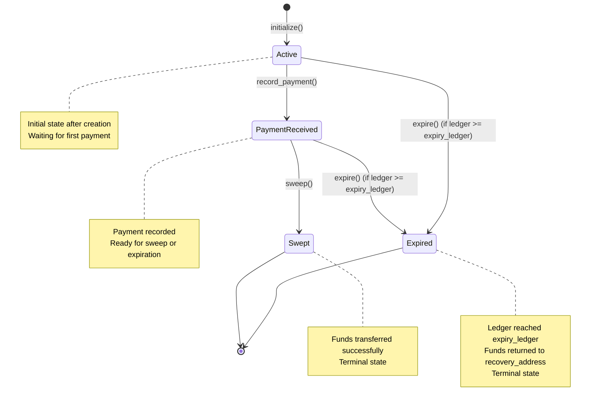
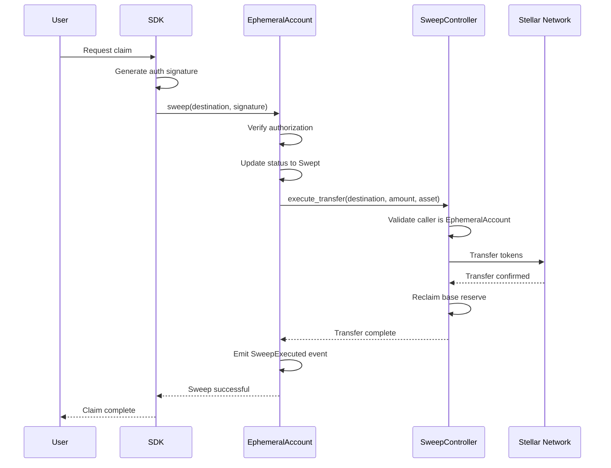
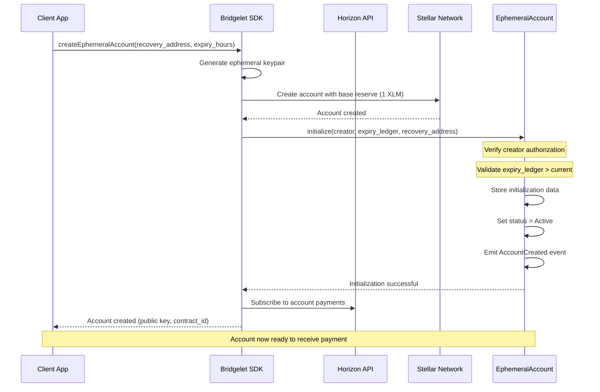
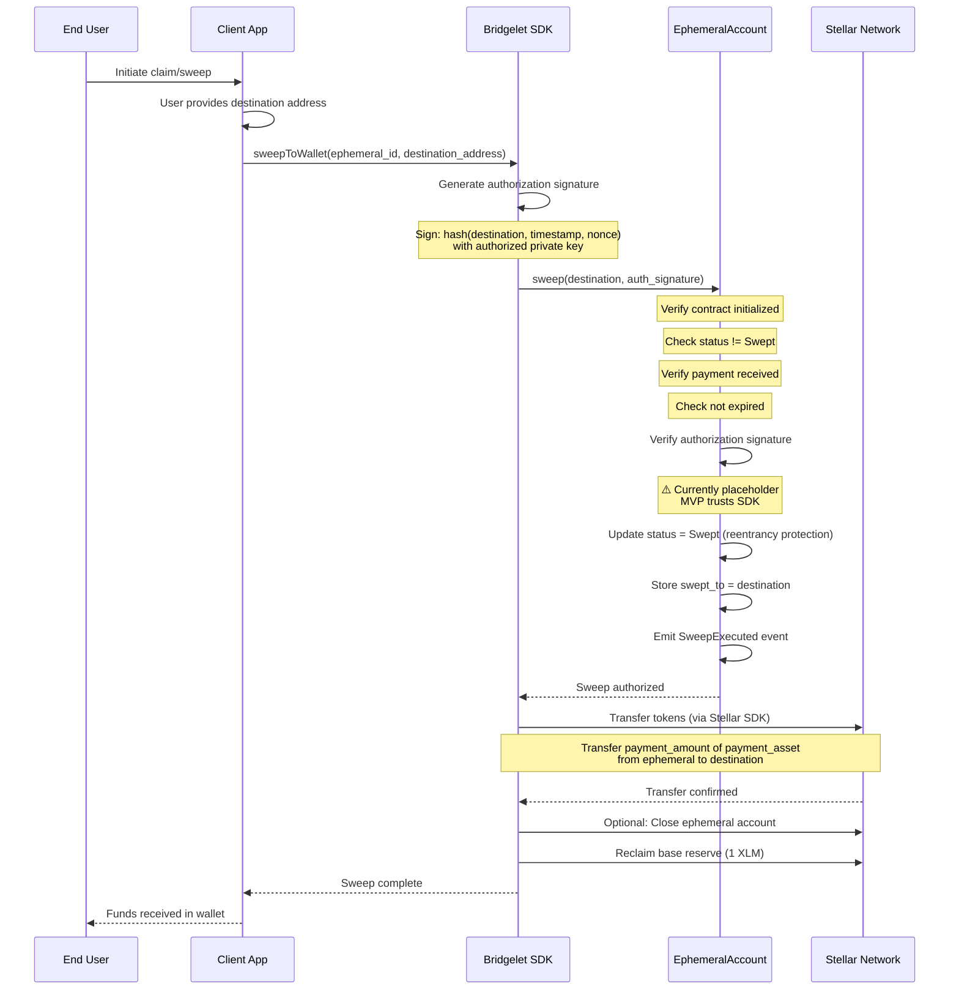
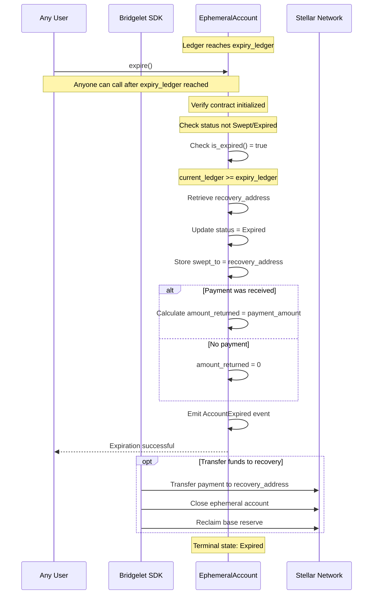

# Bridgelet Core Architecture

**Version:** 1.0  
**Last Updated:** January 21, 2026  
**Status:** MVP

---

## Table of Contents

1. [Introduction](#introduction)
2. [System Architecture](#system-architecture)
3. [Contract Details](#contract-details)
   - [EphemeralAccount Contract](#ephemeralaccount-contract)
   - [SweepController Contract](#sweepcontroller-contract)
4. [Data Flow](#data-flow)
5. [Design Decisions](#design-decisions)
6. [Integration Points](#integration-points)
7. [Limitations](#limitations)

---

## Introduction

### Overview

Bridgelet Core is a suite of Soroban smart contracts that enable secure, single-use ephemeral accounts on the Stellar network. The system enforces business logic restrictions on temporary accounts, ensuring they can only receive one payment and be swept to a pre-authorized destination or expire after a defined period.

### Target Audience

This document is intended for:

- **SDK Developers** - Building applications on top of Bridgelet Core
- **Security Auditors** - Reviewing contract security and design decisions
- **Integration Partners** - Connecting external systems to the Bridgelet ecosystem
- **Contract Maintainers** - Understanding the codebase for maintenance and upgrades

### Document Scope

This architecture document covers:

- High-level system design and component interactions
- Detailed contract specifications and interfaces
- Complete data flow for all operations
- Rationale for key design decisions
- Integration patterns and off-chain requirements
- Current limitations and future improvement plans

---

## System Architecture

### Component Overview

The Bridgelet Core system consists of three primary components:

```
┌─────────────────────────────────────────────────────────┐
│                    Bridgelet SDK (NestJS)               │
│                                                         │
│  ┌─────────────┐  ┌─────────────┐  ┌─────────────┐   │
│  │  Account    │  │   Claim     │  │  Lifecycle  │   │
│  │  Creation   │  │   Auth      │  │  Management │   │
│  └─────────────┘  └─────────────┘  └─────────────┘   │
│                                                         │
│  - Horizon API Integration                             │
│  - Signature Generation                                │
│  - Event Indexing                                      │
│  - Token Transfer Execution                            │
└────────────────────────┬────────────────────────────────┘
                         │ Soroban Contract Invocations
                         ▼
┌─────────────────────────────────────────────────────────┐
│              Stellar Network (Testnet/Mainnet)          │
│                                                         │
│  ┌───────────────────────────────────────────────────┐ │
│  │        EphemeralAccount Contract                  │ │
│  │                                                   │ │
│  │  • State Management (Active/Paid/Swept/Expired)  │ │
│  │  • Payment Recording & Validation                │ │
│  │  • Authorization Verification                    │ │
│  │  • Expiration Logic (Ledger-based)               │ │
│  │  • Event Emission (Auditability)                 │ │
│  │                                                   │ │
│  │  Storage: Instance Storage                       │ │
│  │  Events: AccountCreated, PaymentReceived,        │ │
│  │          SweepExecuted, AccountExpired           │ │
│  └───────────────────┬───────────────────────────────┘ │
│                      │                                  │
│                      │ Calls on sweep                   │
│                      ▼                                  │
│  ┌───────────────────────────────────────────────────┐ │
│  │        SweepController Contract (Planned)         │ │
│  │                                                   │ │
│  │  • Authorization Validation                       │ │
│  │  • Atomic Token Transfers                        │ │
│  │  • Multi-Asset Support                           │ │
│  │  • Base Reserve Reclamation                      │ │
│  │  • Batch Operations                              │ │
│  │                                                   │ │
│  │  Note: Currently in planning phase               │ │
│  └───────────────────────────────────────────────────┘ │
│                                                         │
└─────────────────────────────────────────────────────────┘
```

### Component Responsibilities

#### Bridgelet SDK (Off-Chain)

The SDK serves as the orchestration layer between client applications and smart contracts:

- **Account Creation**: Generates ephemeral accounts and calls `initialize()`
- **Payment Monitoring**: Watches Horizon API for incoming payments
- **Authorization**: Generates cryptographic signatures for sweep operations
- **Transfer Execution**: Executes actual token transfers via Stellar SDK
- **Event Indexing**: Subscribes to contract events for state tracking
- **Lifecycle Management**: Handles expiration and recovery scenarios

#### EphemeralAccount Contract (On-Chain)

The primary business logic contract that enforces restrictions:

- **State Enforcement**: Manages account lifecycle through state machine
- **Payment Validation**: Ensures only one payment is accepted
- **Authorization**: Verifies sweep authorization (signature validation)
- **Expiration**: Automatically handles time-based account expiry
- **Auditability**: Emits events for every state transition

**Current Status**: ✅ Fully Implemented

#### SweepController Contract (On-Chain - Planned)

Planned contract for secure fund transfer execution:

- **Transfer Logic**: Executes atomic token transfers from ephemeral to permanent wallets
- **Multi-Asset Support**: Handles transfers of multiple asset types
- **Reserve Management**: Reclaims base reserves after sweep
- **Batch Operations**: Potentially supports sweeping multiple accounts

**Current Status**: 📋 Planned (not yet implemented)

### Network Topology

**Current Deployment**: Stellar Testnet

The system is currently deployed on Stellar Testnet for development and testing. Production deployment will target Stellar Mainnet with the same contract architecture.

**Contract Addresses**:
- EphemeralAccount: `(deployed via soroban contract deploy)`
- SweepController: `(pending implementation)`

---

## Contract Details

### EphemeralAccount Contract

#### Purpose & Responsibilities

The EphemeralAccount contract is the core business logic layer that enforces single-use restrictions on temporary Stellar accounts. It acts as a state machine that validates and tracks the lifecycle of each ephemeral account from creation through either sweep or expiration.

**Key Responsibilities**:
1. Enforce single payment restriction
2. Validate sweep authorization
3. Handle time-based expiration
4. Emit events for auditability
5. Store account metadata and state

#### State Machine

The contract implements a strict state machine with four possible states:



**State Descriptions**:

- **Active** (0): Initial state after `initialize()`. Account is active and waiting for first payment.
- **PaymentReceived** (1): First payment has been recorded. Account is ready for sweep or may expire.
- **Swept** (2): Funds successfully swept to authorized destination. Terminal state.
- **Expired** (3): Account expired and funds returned to recovery address. Terminal state.

**State Transitions**:

| From | To | Trigger | Conditions |
|------|----|---------|-----------  |
| Active | PaymentReceived | `record_payment()` | Payment amount > 0, no prior payment |
| PaymentReceived | Swept | `sweep()` | Valid authorization, not expired |
| PaymentReceived | Expired | `expire()` | Current ledger >= expiry_ledger |
| Active | Expired | `expire()` | Current ledger >= expiry_ledger |

#### Storage Layout

The contract uses Soroban's **instance storage** exclusively, which persists state across invocations and is tied to the contract instance lifecycle.

**Storage Keys** (enum `DataKey`):

| Key | Type | Purpose | Set By | Read By |
|-----|------|---------|--------|---------|
| `Initialized` | `bool` | Tracks if contract initialized | `initialize()` | All functions |
| `Creator` | `Address` | Account creator address | `initialize()` | `get_info()` |
| `ExpiryTimestamp` | `u64` | Unix timestamp when account expires | `initialize()` | `is_expired()`, `expire()` |
| `SweepDestination` | `Option<Address>` | Optional destination for sweep | `initialize()` | `sweep()`, `expire()` |
| `PaymentReceived` | `bool` | Whether first payment recorded | `record_payment()` | `sweep()`, `record_payment()` |
| `PaymentAmount` | `i128` | Amount of recorded payment | `record_payment()` | `sweep()`, `get_info()` |
| `PaymentAsset` | `Address` | Asset address of payment | `record_payment()` | `sweep()`, `get_info()` |
| `Status` | `AccountStatus` | Current state (enum) | Multiple | `get_status()`, state checks |
| `SweptTo` | `Address` | Destination address after sweep/expiry | `sweep()`, `expire()` | `get_info()` |

**Storage Type Rationale**: Instance storage is used (vs. temporary storage) because account state must persist across multiple transactions throughout the account's lifecycle. The cost is justified by the requirement for durable state.

#### Function Reference

##### `initialize()`

**Purpose**: Initialize a new ephemeral account with restrictions.

**Signature**:
```rust
pub fn initialize(
    env: Env,
    creator: Address,
    sweep_destination: Option<Address>,
    expiry_timestamp: u64,
) -> Result<(), Error>
```

**Parameters**:
- `creator`: Address that creates this account (requires authorization)
- `sweep_destination`: Optional destination for sweep (can be set later if None)
- `expiry_timestamp`: Unix timestamp (seconds since epoch) when account expires

**Returns**: `Ok(())` on success, or error

**Errors**:
- `Error::AlreadyInitialized` - Contract already initialized (can only initialize once)
- `Error::InvalidExpiry` - `expiry_timestamp` <= current timestamp (must be in future)
---

##### `record_payment()`

**Purpose**: Record the first (and only) inbound payment to this account.

**Signature**:
```rust
pub fn record_payment(
    env: Env,
    amount: i128,
    asset: Address
) -> Result<(), Error>
```

**Parameters**:
- `amount`: Payment amount in asset units
- `asset`: Asset contract address (native = XLM address)

**Returns**: `Ok(())` on success, or error

**Errors**:
- `Error::NotInitialized` - Contract not initialized
- `Error::PaymentAlreadyReceived` - Payment already recorded (enforces single payment)
- `Error::InvalidAmount` - Amount <= 0

**Important**: This function should be called by the SDK immediately after detecting a payment via Horizon monitoring. The SDK is responsible for payment detection; the contract only validates and records.

---

##### `sweep()`

**Purpose**: Transfer all funds to authorized destination wallet.

**Signature**:
```rust
pub fn sweep(
    env: Env,
    destination: Address
) -> Result<(), Error>
```

**Parameters**:
- `destination`: Recipient wallet address to receive funds

**Returns**: `Ok(())` on success, or error

**Errors**:
- `Error::NotInitialized` - Contract not initialized
- `Error::AlreadySwept` - Already swept (prevents double-sweep)
- `Error::NoPaymentReceived` - No payment to sweep
- `Error::AccountExpired` - Account has reached expiry timestamp
- `Error::Unauthorized` - Invalid authorization (via Soroban auth system)

**Authorization Flow**:
```
User Request → SDK calls sweep() with proper auth context → 
Contract validates via Soroban auth → Approval given → 
SDK executes actual token transfer via Stellar SDK
```

**Important Notes**:
- Authorization is handled through Soroban's native authorization system
- The contract validates authorization but does NOT execute token transfer
- Actual transfer is performed by SDK via Stellar SDK after contract approval
- This separation ensures contract focuses on business logic, not token mechanics

---

##### `is_expired()`

**Purpose**: Check if account has expired based on current timestamp.

**Signature**:
```rust
pub fn is_expired(env: Env) -> bool
```

**Returns**: `true` if current timestamp >= expiry_timestamp, `false` otherwise

---

##### `expire()`

**Purpose**: Handle account expiration and return funds to recovery address.

**Signature**:
```rust
pub fn expire(env: Env) -> Result<(), Error>
```

**Returns**: `Ok(())` on success, or error

**Errors**:
- `Error::NotInitialized` - Contract not initialized
- `Error::NotExpired` - Current timestamp < expiry_timestamp (too early)
- `Error::InvalidStatus` - Already swept or expired (terminal states)

**Important**: This function can be called by anyone once the expiry ledger is reached. The SDK is responsible for executing the actual token transfer to the recovery address after contract approval.

---

##### `get_status()`

**Purpose**: Retrieve current account status.

**Signature**:
```rust
pub fn get_status(env: Env) -> AccountStatus
```

**Returns**: Current `AccountStatus` enum value
---

##### `get_info()`

**Purpose**: Retrieve complete account information.

**Signature**:
```rust
pub fn get_info(env: Env) -> Result<AccountInfo, Error>
```

**Returns**: `AccountInfo` struct with all account data, or error

**Errors**:
- `Error::NotInitialized` - Contract not initialized

**AccountInfo Structure**:
```rust
pub struct AccountInfo {
    pub creator: Address,
    pub status: AccountStatus,
    pub expiry_timestamp: u64,
    pub sweep_destination: Option<Address>,
    pub payment_received: bool,
    pub payment_amount: Option<i128>,
    pub swept_to: Option<Address>,
}
```

#### Events

The contract emits events for all state changes to enable off-chain monitoring, indexing, and auditability.

**Event Design**: Events use `symbol_short!` macro which limits event names to 10 characters for efficiency.

##### `AccountCreated`

**Event Name**: `"created"`

**Payload**:
```rust
pub struct AccountCreated {
    pub account_id: Address,
    pub creator: Address,
    pub expiry: u64,
}
```

**Emitted By**: `initialize()`

**Purpose**: Signals that a new ephemeral account has been created.

**Usage**: Off-chain indexers can track account creation and monitor for expiration. The `account_id` enables efficient filtering by account.

---

##### `PaymentReceived`

**Event Name**: `"payment"`

**Payload**:
```rust
pub struct PaymentReceived {
    pub account_id: Address,
    pub amount: i128,
    pub asset: Address,
}
```

**Emitted By**: `record_payment()`

**Purpose**: Signals that the first (and only) payment has been recorded.

**Usage**: SDK can trigger sweep workflow after detecting this event. The `account_id` enables filtering events by specific account.

---

##### `SweepExecuted`

**Event Name**: `"swept"`

**Payload**:
```rust
pub struct SweepExecuted {
    pub account_id: Address,
    pub destination: Address,
    pub amount: i128,
}
```

**Emitted By**: `sweep()`

**Purpose**: Signals that funds have been authorized for transfer to destination.

**Usage**: Off-chain systems can confirm successful sweep completion. The `account_id` enables filtering events by specific account.

---

##### `AccountExpired`

**Event Name**: `"expired"`

**Payload**:
```rust
pub struct AccountExpired {
    pub account_id: Address,
}
```

**Emitted By**: `expire()`

**Purpose**: Signals that account expired and funds are being returned.

**Usage**: Off-chain systems can detect expiration and handle fund recovery. The `account_id` identifies which account expired.

#### Error Types

The contract defines 12 distinct error codes:

| Error Code | Error Name | Meaning | Thrown By |
|------------|------------|---------|-----------|
| 1 | `AlreadyInitialized` | Contract already initialized | `initialize()` |
| 2 | `NotInitialized` | Contract not initialized | Most functions |
| 3 | `PaymentAlreadyReceived` | Payment already recorded | `record_payment()` |
| 4 | `Unauthorized` | Authorization validation failed | `sweep()` |
| 5 | `AlreadySwept` | Already swept, can't sweep again | `sweep()` |
| 6 | `NotExpired` | Tried to expire before expiry_ledger | `expire()` |
| 7 | `InvalidDestination` | Invalid destination address | (Reserved) |
| 8 | `InvalidAmount` | Amount <= 0 or invalid | `record_payment()` |
| 9 | `InvalidExpiry` | Expiry ledger in past | `initialize()` |
| 10 | `NoPaymentReceived` | No payment to sweep | `sweep()` |
| 11 | `AccountExpired` | Account expired, can't sweep | `sweep()` |
| 12 | `InvalidStatus` | Invalid status for operation | `expire()` |

---

### SweepController Contract

**Status**: 📋 Planned Feature (Not Yet Implemented)

#### Purpose & Responsibilities

The SweepController contract (when implemented) will handle the actual execution of fund transfers from ephemeral accounts to permanent wallets. It separates authorization logic (EphemeralAccount) from execution logic (SweepController).

**Planned Responsibilities**:
1. Execute atomic token transfers
2. Handle multiple asset types (XLM, USDC, custom tokens)
3. Reclaim base reserves after sweep
4. Support batch operations for efficiency
5. Provide reentrancy protection
6. Emit transfer confirmation events

#### Authorization Flow (Planned)



#### Transfer Mechanisms (Planned)

**Single Asset Transfer**:
- Transfer specified amount of single asset type
- Validate sufficient balance
- Execute atomic transfer via Stellar SAC (Smart Asset Contract)

**Multi-Asset Transfer** (Future):
- Iterate through all held assets
- Transfer each asset type
- All-or-nothing atomicity

**Reserve Reclamation**:
- After transfers complete, close ephemeral account
- Reclaim 1 XLM base reserve
- Transfer reserve to destination or recovery address

#### Error Handling (Planned)

Expected error scenarios:
- Insufficient balance for transfer
- Invalid asset contract address
- Transfer operation failed
- Unauthorized caller (not EphemeralAccount contract)
- Reentrancy attempt
- Reserve reclamation failed

#### Implementation Notes

**Why Not Implemented Yet?**

The MVP focuses on the authorization and state management layer (EphemeralAccount contract). The SDK currently handles actual token transfers via the Stellar SDK, which is sufficient for initial testing and validation.

**Future Implementation**:

When implemented, SweepController will:
1. Provide on-chain transfer execution guarantees
2. Enable atomic multi-asset transfers
3. Simplify SDK implementation
4. Improve security through contract-enforced transfers

**API Preview** (Tentative):
```rust
pub trait SweepControllerInterface {
    /// Execute sweep transfer
    fn execute_transfer(
        env: Env,
        caller: Address,  // Must be EphemeralAccount contract
        destination: Address,
        amount: i128,
        asset: Address,
    ) -> Result<(), Error>;
    
    /// Reclaim base reserve
    fn reclaim_reserve(
        env: Env,
        ephemeral_account: Address,
        destination: Address,
    ) -> Result<(), Error>;
}
```

---

## Data Flow

This section documents the complete data flow for all major operations in the Bridgelet Core system.

### Account Creation Flow



---

### Sweep Flow



---

### Expiration Flow



---

## Design Decisions

This section explains the rationale behind key architectural choices in Bridgelet Core.

### Why Two Contracts Instead of One?

**Decision**: Split functionality into EphemeralAccount (authorization) and SweepController (execution) contracts.

**Rationale**:

1. **Separation of Concerns**:
   - EphemeralAccount = "What" and "When" (business logic, state management)
   - SweepController = "How" (token transfer execution)

2. **Modularity**:
   - EphemeralAccount can be upgraded without changing transfer logic
   - SweepController can support multiple authorization contracts
   - Different authorization schemes can use same execution layer

3. **Security**:
   - Isolate complex token transfer logic from state management
   - Easier to audit smaller, focused contracts
   - Reduces attack surface of each contract

4. **Gas/Fee Optimization**:
   - EphemeralAccount only handles validation (cheaper operations)
   - SweepController handles expensive token transfers
   - Can optimize each independently

5. **Future Flexibility**:
   - Support multiple asset types in SweepController
   - Batch operations across multiple accounts
   - Different fee structures for different contract types

**Tradeoff**: Adds complexity (two contracts to deploy, maintain). For MVP, SDK handles transfers to simplify initial implementation.

---

### Why Instance Storage Instead of Temporary Storage?

**Decision**: Use instance storage exclusively for all contract state.

**Rationale**:

1. **State Persistence Required**:
   - Account state must survive across multiple transactions
   - Lifecycle spans from creation → payment → sweep/expiry
   - May take hours or days
   - Temporary storage would expire between operations

2. **Data Integrity**:
   - Instance storage tied to contract instance
   - Cannot be accidentally cleared
   - Survives ledger closes

3. **State Machine Guarantee**:
   - Status transitions must be durable
   - Payment recording must persist
   - Authorization checks depend on stored state

**Tradeoff**: Higher storage costs (~10-100x more expensive than temporary storage). However, this is necessary for the use case and cost is reasonable for single-use accounts.

**Cost Analysis**:
- Instance storage: ~0.001 XLM per entry
- 9 storage keys per account
- Total storage cost: ~0.009 XLM per account
- Acceptable for single-use account model

**Alternative Considered**: Temporary storage with TTL extensions. Rejected because:
- Adds complexity (managing TTL extensions)
- Risk of expiration before sweep
- No cost benefit for single-use model

---

### Why Timestamp-Based Expiry?
Uses unix timestamps are for universally compatible and better developer experience.
---

### Why Single Payment Restriction?
Limiting ephemeral accounts to a single payment simplifies security, state management, and auditability.
---

### Event Design: Why `symbol_short!` Macro?
The symbol_short! macro is used to minimize on-chain storage costs.
---

### Why Soroban Native Authorization for Sweep?
Soroban’s built-in authorization is used for sweeping funds to provide stronger security, cleaner APIs, and future-proof authorization handling without custom signature logic.
---

### Why Reentrancy Protection via Status Update?
Updating the account status before external operations prevents reentrancy attacks, enforces idempotency, and follows established smart contract safety patterns.
---

## Integration Points

This section explains how external systems integrate with Bridgelet Core contracts.

### SDK Integration Patterns

The Bridgelet SDK (NestJS) serves as the primary integration layer between client applications and smart contracts.

#### Initialization Workflow

**SDK Responsibilities**:
#### SDK Integration
The SDK handles account creation, payment monitoring via Horizon API, authorization generation, and token transfer execution after contract approval.


#### Payment Monitoring via Horizon

**SDK Responsibilities**:
1. Subscribe to Horizon streaming API for account
2. Filter for payment operations
3. Validate payment details
4. Call `record_payment()` on contract
5. Notify client application

#### Sweep Execution Coordination

**SDK Responsibilities**:
1. Generate authorization signature
2. Call `sweep()` on contract
3. Wait for contract approval
4. Execute token transfer via Stellar SDK
5. Optionally close account and reclaim reserve

---

### Off-Chain Requirements


#### Event Indexing Infrastructure

**Purpose**: Index contract events for monitoring, analytics, and user notifications.

**Requirements**:
1. **Event Stream Consumer**: Subscribe to Stellar event stream
2. **Database**: Store indexed events with timestamps
3. **Query API**: Provide endpoints for event lookup
4. **Alerting**: Notify users of relevant events

**Benefits of account_id in Events**:
- Efficient filtering: Query events for specific account
- Simplified indexing: Direct account identification
- Better performance: Indexed queries by account_id

---

#### Payment Monitoring Service

**Purpose**: Monitor ephemeral accounts for incoming payments and trigger `record_payment()`.

**Architecture**:
```
┌─────────────────┐
│  Horizon API    │ (Stellar payment stream)
└────────┬────────┘
         │ Streaming payments
         ▼
┌─────────────────┐
│ Payment Monitor │ (SDK service)
│  - Filter       │
│  - Validate     │
│  - Record       │
└────────┬────────┘
         │ Contract invocation
         ▼
┌─────────────────┐
│ EphemeralAccount│ (Soroban contract)
│   Contract      │
└─────────────────┘
```

**Requirements**:
- High availability (99.9%+ uptime)
- Low latency (detect payment within 1 ledger = 5 seconds)
- Error handling and retry logic
- Payment validation
- Status tracking

**Failure Handling**:
- Payment detected but contract call fails → Retry with exponential backoff
- Multiple payments detected → Log warning, only record first
- Contract already has payment → Log duplicate, skip